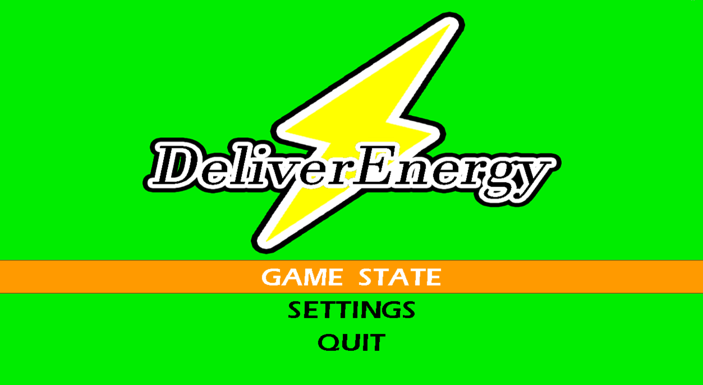
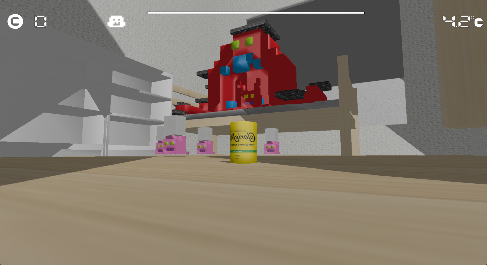
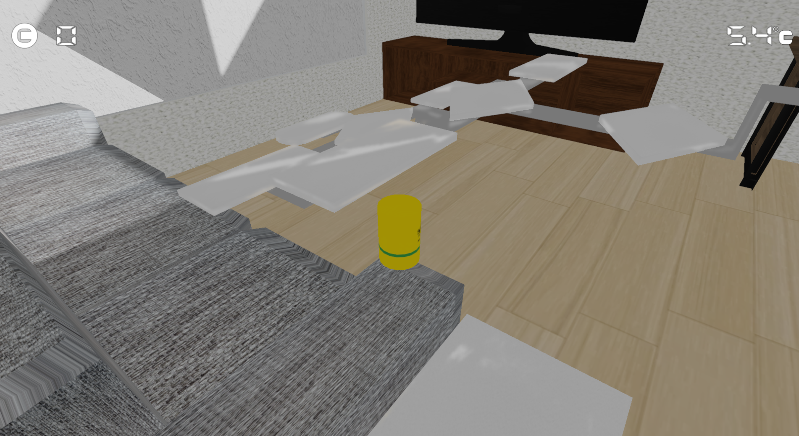
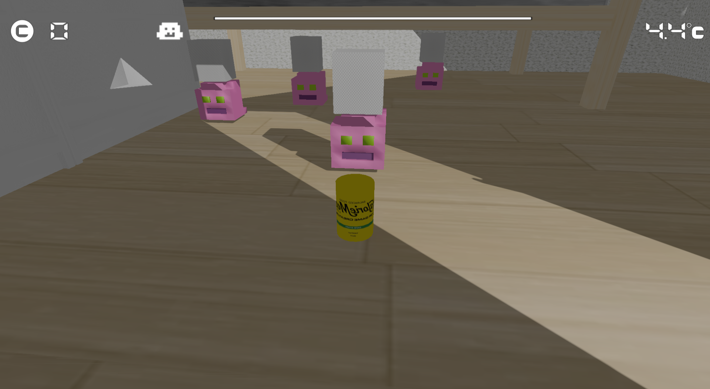
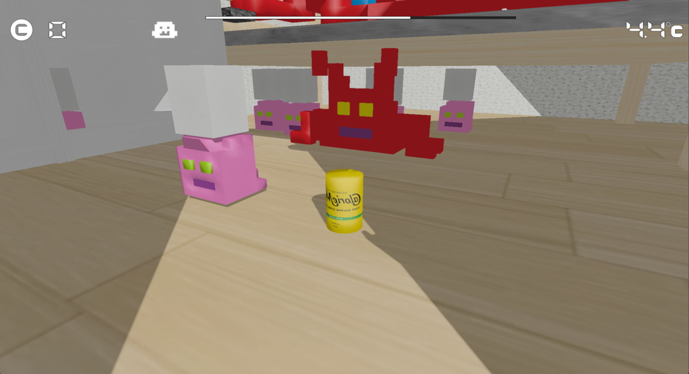
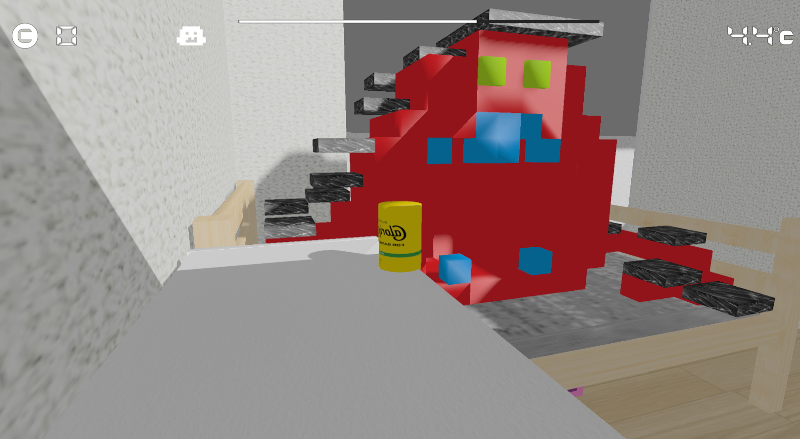

<link rel="stylesheet" href="style.css">

# DeliverEnergy

**河原電子ビジネス専門学校　ゲームクリエイター科2年** **氏名：伊藤侑生**

**↓宛先はこちらです↓**

CA01244004@st.kawahara.ac.jp

**↓Youtubeのリンク↓**

<a href="https://www.youtube.com/watch?v=uDLO4aQJlrk" target="_blank">https://www.youtube.com/watch?v=uDLO4aQJlrk</a>
---

## 目次
1. [作品概要](#1-作品概要)
2. [担当ソースコード](#2-担当ソースコード)
3. [操作説明](#3-操作説明)
4. [ゲーム説明](#4-ゲーム説明)
   * **4.1** . [ゲーム詳細](#41-ゲーム詳細)

   * **4.2** . [プレイヤーについて](#43-プレイヤーについて)
        * **1** . [缶の状態](#1-缶の状態)
        * **2** . [カメラ基準の入力処理](#2-カメラ基準の入力処理)
        * **3** . [クォータニオンを用いた複雑な3次元回転の制御](#3-クォータニオンを用いた複雑な3次元回転の制御)
   * **4.3** . [敵について](#44-敵について)
        * **1** . [ボス](#1-ボス)
          * **a** . [ボスの役割とコンセプト](#a-ボスの役割とコンセプト)
          * **b** . [実装上の特徴](#b-実装上の特徴-state-pattern)
        * **2** . [眷属](#2-眷属)
          * **a** . [眷属の役割とコンセプト](#a-眷属の役割とコンセプト)
          * **b** . [実装上の特徴](#b-実装上の特徴-同期制御)
        * **3** . [雑魚敵](#3-雑魚敵)
          * **a** . [雑魚敵の役割とコンセプト](#a-雑魚敵の役割とコンセプト)
          * **b** . [実装上の特徴](#b-実装上の特徴-ai-controller--waypoints)
5. [技術紹介](#5-技術紹介)

---

## 1. 作品概要

* **タイトル**: DeliverEnergy
* **制作人数**: 1人
* **制作期間**: 2025年9月 ～ 2025年1月
* **ゲームジャンル**: 3Dアクションゲーム
* **プレイ人数**: 1人
* **使用言語**:
    * C++
    * HLSL
* **使用ツール**:
    * **プログラム(C++)**: Visual Studio 2022
    * **プログラム(HLSL)**: VS Code
    * **3Dソフト**: 3ds Max
    * **エフェクト**: Effekseer
    * **画像**: Adobe Photoshop 2025, FireAlpaca64
    * **バージョン管理**: Git, GitHub, Fork
    * **タスク管理**: Notion
    * **動画作成**: Adobe PremierePro
* **開発環境**:
    * **エンジン**: 学校内製の簡易エンジン (DirectX12)
    * **OS**: Windows11

---

## 2. 担当ソースコード

### ▶ ゲーム部分 (ゲームの進行)
* BackGround.cpp / .h
* CoinUI.cpp / .h
* Countdown.cpp / .h
* Game.cpp / .h
* GameCamera.cpp / .h
* GameClear.cpp / .h
* GameStateBase.cpp / .h
* GameTimeUI.cpp / .h
* GetItem.cpp / .h
* InGameState.cpp / .h
* main.cpp
* Pause.cpp / .h
* Player.cpp / .h
* Setting.cpp / .h
* StageManager.cpp / .h
* stdafx.cpp / .h
* Title.cpp / .h

### ▶ Athletic
* AthleticBase.cpp / .h
* AthleticManager.cpp / .h
* AthleticStage.cpp / .h
* AthleticTrigger.cpp / .h

### ▶ Collision
* CollisionHitManager.cpp / .h

### ▶ Enemy
* Boss.cpp / .h
* BossStatusUI.cpp / .h
* EnemyBase.cpp / .h
* EnemyController.cpp / .h
* EnemyManager.cpp / .h
* EnemyStatePattern.cpp / .h
* EnemyStatus.cpp / .h
* Familiar.cpp / .h
* NoobEnemy.cpp / .h

---

## 3. 操作説明

---

## 4. ゲーム説明

### 4.1 ゲーム詳細
このゲームは、栄養ドリンクを操作して家主の元までたどり着くとゲームクリアになります。
プレイヤーは**直立モード**と**転がりモード**を駆使してステージを攻略していきます。
### 直立モード

### 転がりモード

マップ構成はボスと戦うステージとアスレチックを攻略するステージの2種類が一体型となったマップ構成になっています。

### ボスステージ
 
### アスレチックステージ

### 4.2 プレイヤーについて

### 1. 缶の状態
『直立モード』と『転がりモード』という2つの状態をステートを使って切り替えるアクションを実装しました。
特に転がり状態では、単純な移動ではなく加速度ベクトルを用いた慣性処理を行い、缶特有の『重み』と『転がり感』を再現しました。また、現在の移動速度をジャンプ力に加算する処理を入れることで、加速を利用して遠くへ飛ぶという挙動を行っています。

### 2. カメラ基準の入力処理
コントローラー（左スティック）の入力を、カメラの視点方向（Forward / Rightベクトル）に合わせて変換しています。これにより、カメラがどこを向いていても、プレイヤーが「画面上の見たままの方向」に入力できる直感的な操作を行っています。

### 3. クォータニオンを用いた複雑な3次元回転の制御
プレイヤーの回転制御にはクォータニオン（四元数）を採用しました。『進行方向への旋回』『転倒時の姿勢制御』『移動距離に基づいた自転アニメーション』の3要素を合成し、ジンバルロックを防ぎつつ意図通りの挙動を実装しています。また、状態遷移時にはSlerpを用いた球面線形補間を行い、急激な挙動変化のない滑らかな姿勢変更を実現しました。

### 4.3 敵について
敵は、ボス、ボスの眷属、雑魚敵の3種類が存在します。

### 雑魚敵

### ボスの眷属

### ボス

敵AIの構築には**ステートパターン**を採用しました。『待機』『移動』『召喚』といった行動を個別のクラスとして実装し、状態遷移の条件を明確に定義することで、複雑なボス戦のフローをバグなく管理しています。これにより、新しい攻撃パターンの追加や仕様変更にも柔軟に対応できる設計となっています。

### 1. ボス
ゲームの進行を司る中心的な存在であり、自ら攻撃するだけでなく、部下（眷属）を召喚してけしかける「司令塔」としての役割を持っています。

* #### a. ボスの役割とコンセプト
    * **司令塔**: ボス自体は直接攻撃しても倒せず、召喚した「眷属」をすべて倒すことで初めてダメージが入るギミックを持っています。
    * **フェーズ管理**: HP（初期値3）が減るごとに、新しい敵の生成（召喚）フェーズへと移行し、戦闘の難易度を段階的に引き上げます。
* #### b. 実装上の特徴 (State Pattern)
    * **行動遷移**: `BossIdleState`（待機）→ `BossMoveState`（移動）→ `BossCreateFamiliarState`（召喚）というサイクルで行動します。
    * **上下の動き**: `BossMoveState`では、`ComputeNextPosition`関数を用いて、指定されたY座標の範囲内（`BOSS_MIN_Y` ～ `BOSS_MAX_Y`）を浮遊するように往復移動します。
    * **召喚リクエスト**: 自身で敵を生成するのではなく、`m_isRequestCreateFamiliar`フラグを立てて`EnemyManager`に生成を依頼する形をとっており、オブジェクト間の責任分界点が明確です。

### 2. 眷属
ボスの「分身体」であり「本体」とも言える存在です。ボスの周囲をガードするように浮遊し、プレイヤーの標的となります。

* #### a. 眷属の役割とコンセプト
    * **ボスの分身体**: ボスのHP減少のトリガーとなる重要な敵です。倒されると`EnemyManager`を経由してボスにダメージを与えます。
    * **随伴行動**: 独立して動くのではなく、ボスの動きに合わせて移動します。
* #### b. 実装上の特徴 (同期制御)
    * **親との同期**: `FamiliarMoveState`内で`EnemyManager`からボスのインスタンスを取得し、ボスの移動方向フラグ（`IsMovingUp`）を参照しています。
    * **速度の調整**: ボスと全く同じ動きをするのではなく、`syncSpeedRatio`（例: 140/200）を掛けることで、ボスに追従しつつも少し遅れて動くような、浮遊感のある慣性表現を実装しています。
    * **バリエーション**: `Setup`関数でタイプ（A, B）を指定することで、読み込むモデル（`bossEnemy_TypeA.tkm`等）を切り替え、見た目にバリエーションを持たせています。

### 3. 雑魚敵
画面を賑やかにし、プレイヤーの邪魔をする大量の敵キャラクターです。

* #### a. 雑魚敵の役割とコンセプト
    * **数で威圧する**: 眷属召喚のタイミングに合わせて、一度に複数体（4体セットなど）が出現します。
    * **多様な出現パターン**: 出現するウェーブ数（ボスのダメージ段階）に応じて、出現位置や移動ルートが変化します。
* #### b. 実装上の特徴 (AI Controller & Waypoints)
    * **分離されたAI**: `NoobEnemy`クラス自体は単純な移動（`NoobEnemyMoveState`）を行うのみで、複雑な思考ルーチンは`EnemyController`クラスに委譲しています。
    * **ウェイポイント巡回**: `EnemyController`は`MOVE_POSITION_LIST`に定義された4つの座標（ウェイポイント）を持っています。タイプ（A～Lの12種類）ごとに異なる巡回ルートが設定されており、単調な動きにならないよう工夫されています。
    * **目標追従**: `EnemyController`がターゲット座標を計算し、`NoobEnemy`に対して移動ベクトル（`SetMoveVector`）を設定することで操作する、操り人形のような制御構造になっています。

---

## 5. 技術紹介
### 1. プレイヤーの転がり処理
* **課題**: 円筒状のキャラクターが地面を転がる際、移動方向と回転軸がずれると不自然に見えてしまう。また、急に止まると重量感が損なわれてしまうという課題がありました。

* **工夫**: 
    #### 1.擬似的な慣性 (Inertia):
     通常のキャラクターコントローラーは入力ストップで即停止します。そこでrollVelocityを変数として持ち、rollVelocity *= 0.5f; のように減衰処理を書いて「滑るような動き」を作りました。
    #### 2. 速度の合成:
    入力ベクトル」と「転がり慣性」をベクトル加算して、最終的な移動量を決定しています。
    慣性ベクトルを保持し、入力停止後も徐々に減速させる処理を実装しました。
* **結果**: 操作に心地よい慣性が生まれて、プレイヤーが「物理的にそこに存在する」感覚を実現できました。

